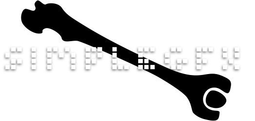

<!-- PROJECT SHIELDS -->
<!--
*** I'm using markdown "reference style" links for readability.
*** Reference links are enclosed in brackets [ ] instead of parentheses ( ).
*** See the bottom of this document for the declaration of the reference variables
*** for contributors-url, forks-url, etc. This is an optional, concise syntax you may use.
*** https://www.markdownguide.org/basic-syntax/#reference-style-links
-->
[![Contributors][contributors-shield]][contributors-url]
[![Forks][forks-shield]][forks-url]
[![Stargazers][stars-shield]][stars-url]
[![Issues][issues-shield]][issues-url]
[![MIT License][license-shield]][license-url]
[![LinkedIn][linkedin-shield]][linkedin-url]


<!-- PROJECT LOGO -->
<br />
<p align="center">
  <a href="https://github.com/mariana-lab/simple-gfx-game-skeleton">
    
  </a>

  <h3 align="center">SIMPLE GRAPHICS GAME SKELETON</h3>

  <p align="center">
    An awesome project template to jumpstart your winie minie games!
    <br />
    <a href="https://github.com/mariana-lab/simple-gfx-game-skeleton"><strong>Explore the docs »</strong></a>
    <br />
    <br />
    <a href="https://github.com/mariana-lab/simple-gfx-game-skeleton">View Demo</a>
    ·
    <a href="https://github.com/mariana-lab/simple-gfx-game-skeleton/issues">Report Bug</a>
    ·
    <a href="https://github.com/mariana-lab/simple-gfx-game-skeleton/issues">Request Feature</a>
  </p>
</p>


<!-- TABLE OF CONTENTS -->
## Table of Contents

* [About the Project](#about-the-project)
<!--  * [Built With](#built-with)-->
* [Getting Started](#getting-started)
  * [Prerequisites](#prerequisites)
  * [Installation](#installation)
* [Usage](#usage)
* [Roadmap](#roadmap)
* [Contributing](#contributing)
* [License](#license)
* [Contact](#contact)
* [Acknowledgements](#acknowledgements)


<!-- ABOUT THE PROJECT -->
## About The Project

[![Product Name Screen Shot][product-screenshot]](https://example.com)

This is a skeleton project put up together to make it easier to quickstart a new idea.
Simple-GFX is a small graphics library for java. One should not understimate the pleasure and freedom of mini game-dev. :)
The structure of the project is based on the strategy design pattern where the game engine is agnostic to the implementations of its screens.

<!-- ### Built With
***This section should list any major frameworks that you built your project using. Leave any add-ons/plugins for the ***acknowledgements section. Here are a few examples.
**** [Bootstrap](https://getbootstrap.com)
**** [JQuery](https://jquery.com)
**** [Laravel](https://laravel.com)-->


<!-- GETTING STARTED -->
## Getting Started

This is an example of how you may give instructions on setting up your project locally.
To get a local copy up and running follow these simple example steps.

### Prerequisites

You'll need an IDE of your choice to program.
<!--* npm
***```sh
***npm install npm@latest -g
***```-->

### Installation
1. Clone the repo
```sh
git clone https:://github.com/your_username_/Project-Name.git
```
2. Open the project with your IDE
<!--3. Install NPM packages
***```sh
npm install
***```
***4. Enter your API in `config.js`
***```JS
***const API_KEY = 'ENTER YOUR API';
***```-->


<!-- USAGE EXAMPLES -->
<!--## Usage
***Use this space to show useful examples of how a project can be used. Additional screenshots, code examples and demos work ***well in this space. You may also link to more resources.
***_For more examples, please refer to the [Documentation](https://example.com)_-->


<!-- ROADMAP -->
## Roadmap

See the [open issues](https://github.com/mariana-lab/simple-gfx-game-skeleton/issues) for a list of proposed features (and known issues).


<!-- CONTRIBUTING -->
## Contributing

Contributions are what make the open source community such an amazing place to be learn, inspire, and create. Any contributions you make are **greatly appreciated**.

1. Fork the Project
2. Create your Feature Branch (`git checkout -b feature/AmazingFeature`)
3. Commit your Changes (`git commit -m 'Add some AmazingFeature'`)
4. Push to the Branch (`git push origin feature/AmazingFeature`)
5. Open a Pull Request


<!-- LICENSE -->
## License

Distributed under the MIT License. See `LICENSE` for more information.


<!-- CONTACT -->
## Contact

linkedin: [mariana-lab](https://www.linkedin.com/in/mariana-lab/)
twitter: [@mariana_lab](https://twitter.com/mariana_lab)
email: mariana.antasdebarros@gmail.com
Project Link: [simple-gfx-game-skeleton](https://github.com/mariana-lab/simple-gfx-game-skeleton)


<!-- ACKNOWLEDGEMENTS -->
## Acknowledgements
* [Academia de Código](https://https://applyto.academiadecodigo.org/)
* [Simple Graphics Library](https://github.com/academia-de-codigo/simple-graphics)
* [best-README](https://github.com/othneildrew/Best-README-Template/)


<!-- MARKDOWN LINKS & IMAGES -->
<!-- https://www.markdownguide.org/basic-syntax/#reference-style-links -->
[contributors-shield]: https://img.shields.io/github/contributors/mariana-lab/simple-gfx-game-skeleton.svg?style=flat-square
[contributors-url]: https://github.com/mariana-lab/simple-gfx-game-skeleton/graphs/contributors
[forks-shield]: https://img.shields.io/github/forks/mariana-lab/simple-gfx-game-skeleton.svg?style=flat-square
[forks-url]: https://github.com/mariana-lab/simple-gfx-game-skeleton/network/members
[stars-shield]: https://img.shields.io/github/stars/mariana-lab/simple-gfx-game-skeleton.svg?style=flat-square
[stars-url]: https://github.com/mariana-lab/simple-gfx-game-skeleton/stargazers
[issues-shield]: https://img.shields.io/github/issues/mariana-lab/simple-gfx-game-skeleton.svg?style=flat-square
[issues-url]: https://github.com/mariana-lab/simple-gfx-game-skeleton/issues
[license-shield]: https://img.shields.io/github/license/mariana-lab/simple-gfx-game-skeleton.svg?style=flat-square
[license-url]: https://github.com/mariana-lab/simple-gfx-game-skeleton/blob/master/LICENSE.txt
[linkedin-shield]: https://img.shields.io/badge/-LinkedIn-black.svg?style=flat-square&logo=linkedin&colorB=555
[linkedin-url]: https://www.linkedin.com/in/mariana-lab/
[product-screenshot]: images/screenshot.png
